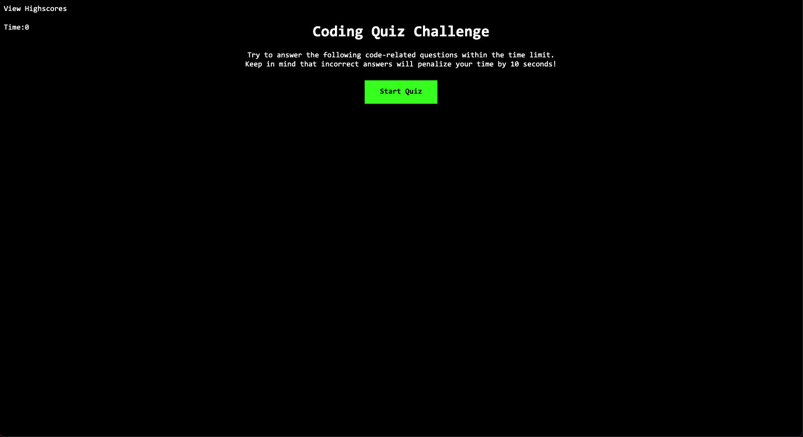

# Code-Quiz-HW-04
Homework Week 4 - Code Quiz

This page is a quiz for the user to test their knowledge on code.  
They are presented with a start button, which when clicked will begin the quiz.  
The quiz will end if the timer runs out, or if the user answers all the questions  
Once the quiz has ended, the user can see their score on the highscores page.  
Their score will be ranked in order of highest to lowest among other scores. 
 
Unfortunately this week I was very short on time due to a family issue. I wanted to submit my code even though unfinished, so I can receive feedback and continue to work on it to resubmit at a later time. 
 

# Screenshot

# Links
GitHub Repo: https://github.com/nicoletr/Code-Quiz-HW-04  
Deployed Application: https://nicoletr.github.io/Code-Quiz-HW-04/

